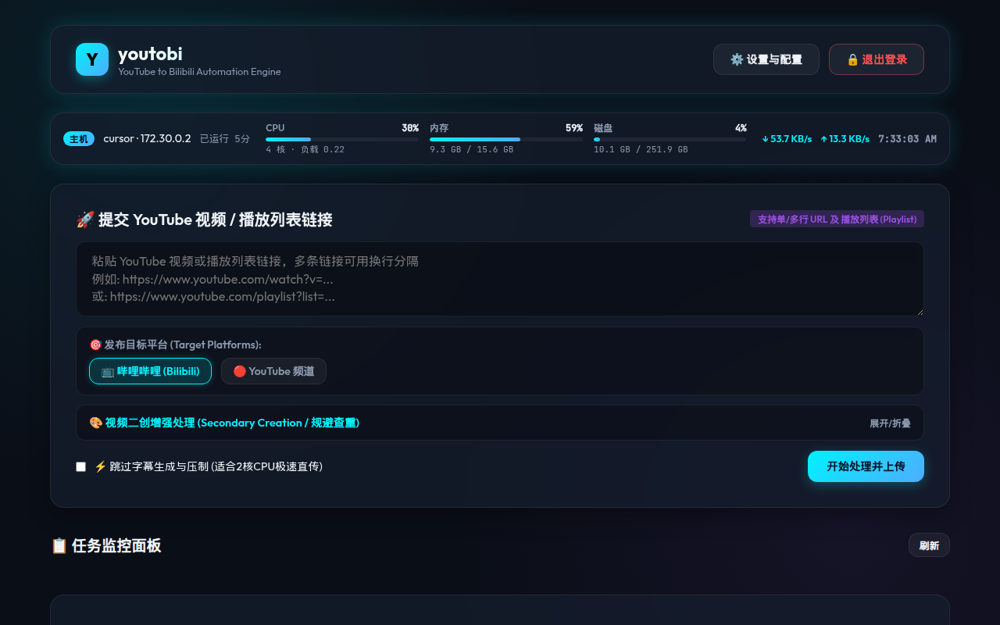
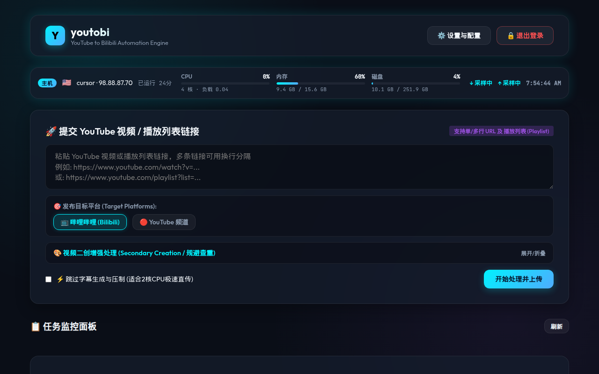

# youtobi - YouTube & Bilibili Automated Video Processing & Publishing System

<p align="center">
  <b>一站式 YouTube / Bilibili 视频搬运、智能二创、双平台同步自动化系统</b><br>
  <i>All-in-One Automated Video Downloader, Secondary Creation, Subtitle Burn-in, and Multi-Platform Publishing Engine</i>
</p>

<p align="center">
  默认分支 / default branch: <b><code>master</code></b>
</p>

---

## 🌟 核心特性 (Features)

### 1. 🚀 双平台自动上传发布 (Dual-Platform Auto Upload)
- **多目标自由选择**：单次提交可选仅 Bilibili（`bilibili`）、仅 YouTube（`youtube`），或两者一起（`["bilibili", "youtube"]`）。首页勾选「哔哩哔哩 / YouTube 频道」即可，未传时回退到配置里的 `upload_targets`（默认 `["bilibili"]`）。
- **多链接与播放列表**：文本框支持多行 URL。`POST /api/tasks` 会拆成多条独立任务。
- **YouTube Data API v3**：OAuth 2.0、resumable upload（8MB 分片，单片失败重试 3 次）、缩略图、隐私状态（`public` / `unlisted` / `private`，默认 `unlisted`）以及分类 ID（下拉 + 手填，默认 `22`）。
- **OAuth 回调**：`GET /oauth2callback` 落地页用授权 code 换 Refresh Token 并写入配置。授权范围是 `youtube.upload` 与 `youtube.readonly`。
- **Bilibili 上传**：带 Cookie 直传。超过 8 小时（28800 秒）自动切分 P 并走多 P。成功后保存 BV 号，任务卡给出 `https://www.bilibili.com/video/{bvid}`。

### 2. 🎨 视频智能二创引擎 (Secondary Creation Engine)
二创与字幕烧录走 **同一条 FFmpeg `-vf` 滤镜链**，只压制一次：
- **水平镜像 (`hflip`)**。
- **黑边缩放**：边框比例 `0`–`0.20`（界面 0%–20%）。
- **低透明度文字水印**：默认 alpha `0.012`，日常播放几乎看不见，拉高对比度后可作标记。
- 字幕需要烧录时，与镜像 / 黑边 / 水印放在同一次滤镜里。

提交页有「视频二创增强处理」折叠面板；也可以在设置里保存默认值。任务卡会标出本条任务实际用了哪些二创。

### 3. 🎙️ 智能字幕与语音识别 (Subtitles & Whisper STT)
- 用视频语言判断是否中文。已有中文字幕时不烧录；其他语言下载字幕轨并译成简体中文 SRT。
- 没有外挂字幕时，会用 ffprobe 看内嵌字幕并用 ffmpeg 抽出。
- **Whisper**：没有可用字幕且开启了 Whisper 时，抽音频走兼容 OpenAI 的转写接口（默认模型 `whisper-1`），再切成 SRT。
- 非中文 SRT 经 LLM 分块翻译。
- **跳过字幕**：提交页或任务卡可打开 `skip_subtitles`，字幕识别和烧录都跳过，适合小机器直传。接口是 `POST /api/tasks/{task_id}/skip_subtitles`。

### 4. 🤖 AI 标题与简介 (LLM Metadata)
- 任意 OpenAI 兼容接口（Base URL、模型名、API Key）。设置里可以拉模型列表（`POST /api/llm/models`）并试一次调用（`POST /api/llm/test`）。
- 开启且 Key 有效时，用原标题和简介生成中文标题、长简介和标签。调用失败会重试，最多 3 次，然后回退原文。
- 勾选了 LLM 但没填 Key，或根本没开启时，直接用 YouTube 原标题和简介。任务卡会标明这条简介是否来自 LLM。

### 5. ☁️ CookieCloud 凭据同步 (CookieCloud)
- 设置里填写服务器地址、UUID、密码后，可手动 `POST /api/cookiecloud/sync`。
- **每条任务的流水线开头都会再同步一次**（已配置 URL、UUID、密码时），包括新建、**启动**（`POST /api/tasks/{task_id}/start`）和 **重试**（`POST /api/tasks/{task_id}/retry`）。同步到的 YouTube Netscape Cookie 与 Bilibili `SESSDATA` / `bili_jct` / `DedeUserID` 写回配置，再进入后面的阶段。`cookie_sync` 不能跳过。
- 新建任务时，同步失败只记警告，流水线用当前已保存的 Cookie 继续。**启动和重试不一样**：CookieCloud 已配置但同步抛错时，任务停在 `cookie_sync`，后面的阶段不会跑，已经写入的 Cookie 保持上次成功的值。未配置 CookieCloud 时这一步直接跳过。
- 解密兼容 CryptoJS legacy（MD5 `EVP_BytesToKey`）和 AES-128-CBC（固定零 IV，以及 key-as-IV）。
- 同仓库的 [`cookiecloud-cloudflare/`](cookiecloud-cloudflare/README.md) 是一份可部署到 Cloudflare Workers / Pages 的 CookieCloud 服务端，用 KV 存加密 Cookie。
- 敏感字段在设置接口里脱敏返回。`auto_delete_after_upload` 默认开启，发布成功后删除该任务的本地下载目录。

### 6. 📊 主机资源条 (Host Resource Banner)
登录后的首页，标题栏下面有一条粘性主机条。页面加载后立刻拉一次，约 1.5 秒后再拉一次（这样才有带宽差值），之后每 **15 秒** 轮询。

数据来自需登录的 `GET /api/system/stats`（未登录返回 401）。采集失败返回 503，条上显示「更新失败」，并保留上一次成功的数字。

条上展示：
- 主机名、**公网 IPv4**、由两位国家码画出的 **国旗**、开机时长。
- CPU（占用、核数、1 分钟负载）、内存、根分区磁盘（读不到 `/` 时改用进程工作目录）。占用 ≥70% 为警告色，≥90% 为高亮。
- 上下行速率。服务端只给累计字节，浏览器用相邻两次 `sampled_at` 相减。第一次采样显示「采样中」。

公网地址优先读 Cloudflare trace（`https://1.1.1.1/cdn-cgi/trace` 的 `ip` 与 `loc`）。没有全局 IPv4 时再问 `https://api.ipify.org`，国家码再问 `https://ipapi.co/{ip}/country/`。成功结果缓存 5 分钟；查不到时 60 秒后再试，并继续显示上一次的有效地址。



*首页粘性主机条：CPU / 内存 / 磁盘，以及由两次采样算出的带宽。Sticky host banner with CPU, memory, disk, and throughput.*



*公网 IPv4 与国家旗帜显示在主机名旁边。Public IPv4 and country flag sit next to the hostname.*

`GET /api/system/stats` 的字段：`hostname`、`ip`、`country`、`cpu_percent`、`cpu_count`、`load_avg`、`memory`（`total` / `used` / `percent`）、`disk`（`total` / `used` / `percent` / `mount`）、`net`（`bytes_sent` / `bytes_recv`）、`uptime_seconds`、`sampled_at`。

### 7. 📋 任务卡、断点续跑与复制链接 (Task Card, Resume & Copy Link)
任务列表每 3 秒刷新。状态仍是 `PENDING`、`DOWNLOADING`、`SUBTITLE_PROCESSING`、`LLM_REGENERATION`、`UPLOADING`、`COMPLETED`、`FAILED`、`PAUSED`、`CANCELLED`。进度条仍是 0–100，同时每条任务记下 `current_stage`、`completed_stages` 和 `stage_artifacts`（保存在 `tasks.json`）。

阶段顺序：

| 阶段 | 进度进入时 | 可跳过的条件 |
| --- | --- | --- |
| `cookie_sync` | 至少 1% | 从不跳过 |
| `metadata` | 10% | 已有标题，且记录里的 URL 与任务 URL 一致 |
| `download` | 10% → 35% | 源视频文件还在且大小大于 0。空文件会重新下载 |
| `subtitles` | 40% | 字幕阶段已完成，跳过字幕开关没变，需要烧录时 SRT 还在 |
| `edit` | 50% → 65% | 成片还在，且镜像 / 黑边 / 水印 / 字幕选项与上次一致 |
| `llm` | 70% → 80% | 已有最终标题，且来源标题没变 |
| `bilibili_upload` | 85% 起 | 目标包含 Bilibili，且已有 BV 号 |
| `youtube_upload` | 92% 起 | 目标包含 YouTube，且已有视频 ID |

两个上传互不影响：B 站已经成功时，重试只补 YouTube，反过来也一样。没选中的平台不算未完成。重做前面的阶段会作废依赖它的后续阶段（例如重新下载会作废字幕、剪辑和两次上传）。

**启动**和**重试**走同一条续跑路径（`resume=true`）：保留进度、日志、已完成阶段和产物，先做一次 CookieCloud 同步，再从第一个还不能跳过的阶段继续。失败时 `resume_from` 记在当前阶段。新建任务不会把磁盘上的旧文件当成断点。

任务卡在标题旁有 **📋 复制链接**。它复制的是提交时的原始 YouTube URL（`youtube_url`），放在转义过的 `data-copy-url` 里。优先用 `navigator.clipboard.writeText`；被拒绝时退回隐藏 textarea 的 `document.execCommand('copy')`。成功后按钮变成 **✅ 已复制**，1.5 秒后回到 **📋 复制链接**。

已暂停、失败或取消、并且已经完成过至少一个工作阶段时，卡片会写出当前阶段、已完成阶段（展示时略去 `cookie_sync`）和上次错误，重试按钮文案改为 **从断点重试**，并提示「重试会先同步 CookieCloud，再从第一个未完成阶段继续」。

| 按钮 | 接口 | 行为 |
| --- | --- | --- |
| 📋 复制链接 | 浏览器剪贴板 | 复制这条任务的原始 YouTube URL |
| 视频预览 | `GET /api/tasks/{task_id}/stream` | 播放该任务目录里的成片 |
| 暂停 | `POST /api/tasks/{task_id}/stop` | 标记取消，状态改为 `PAUSED` |
| 启动 | `POST /api/tasks/{task_id}/start` | 先同步 CookieCloud，再从第一个未完成阶段继续 |
| 跳过字幕 | `POST /api/tasks/{task_id}/skip_subtitles` | 只改这一条任务的开关 |
| 重试 / 从断点重试 | `POST /api/tasks/{task_id}/retry` | 与启动相同的续跑；不清日志、不把进度打回 0 |
| 删除 | `DELETE /api/tasks/{task_id}` | 取消任务并删掉本地下载目录 |
| 取消 | `POST /api/tasks/{task_id}/cancel` | 状态改为 `CANCELLED`（界面主按钮是暂停 / 删除） |

发布成功后，卡片给出 B 站 BV 链接和 YouTube 观看链接。YouTube Data API 自己的 resumable upload（8MB 分片）仍然只覆盖单次上传会话。

---

## 🏗️ 系统架构 (Architecture)

页面实际加载的脚本是 `static/js/app.js`（`templates/index.html` → `/app_static/js/app.js`）。`app_v2.js` 与 `youtobi_app.js` 还在仓库里，模板没有引用它们。

```
youtobi/
├── app.py                      # FastAPI、登录中间件、/api/system/stats、任务与 OAuth 路由
├── config.py                   # 默认配置与 config.json 读写
├── config.example.json         # 配置示例（无真实密钥）
├── requirements.txt            # Python 依赖（含 psutil，供主机条采集）
├── LICENSE                     # MIT
├── services/
│   ├── bilibili.py             # Bilibili 上传与超过 8 小时的分 P
│   ├── cookiecloud.py          # CookieCloud 拉取与解密
│   ├── llm.py                  # 标题 / 简介 / 字幕翻译
│   ├── subtitle.py             # SRT、内嵌字幕、Whisper
│   ├── task_manager.py         # 分阶段流水线、断点续跑与 tasks.json
│   ├── video_editor.py         # FFmpeg 单次 -vf：镜像、黑边、水印、烧录
│   ├── youtube.py              # yt-dlp 元数据、下载、多 URL / 播放列表拆分
│   └── youtube_uploader.py     # YouTube Data API v3 OAuth 与 resumable upload
├── static/
│   ├── css/style.css           # 暗色玻璃拟态样式，含主机条
│   └── js/app.js               # 首页：主机条 15s 轮询、阶段进度、复制链接、设置
├── templates/
│   ├── index.html              # 控制台（主机条、提交、二创、任务列表、设置）
│   └── login.html              # 管理登录
├── tests/
│   └── test_youtobi.py         # unittest 套件，31 个测试方法
├── cookiecloud-cloudflare/     # 可选的 Cloudflare CookieCloud 服务端
└── docs/
    ├── images/                 # 本 README 的界面截图
    ├── plans/
    └── specs/
```

运行时文件 `config.json`、`tasks.json`、`downloads/` 被 `.gitignore` 忽略。

---

## ⚡ 快速上手 (Quick Start)

### 1. 环境准备
- **操作系统**：Linux / macOS / Windows
- **Python**：3.10+
- **系统依赖**：`ffmpeg` 与 `ffprobe`

```bash
# Ubuntu / Debian
sudo apt-get update && sudo apt-get install -y ffmpeg

# macOS
brew install ffmpeg
```

### 2. 安装与运行

仓库默认分支是 **`master`**。

```bash
git clone https://github.com/rayleeafar/youtobi.git
cd youtobi

python3 -m venv venv
source venv/bin/activate
pip install -r requirements.txt

python3 app.py
```

服务监听 `0.0.0.0:8166`。浏览器打开 `http://localhost:8166`。初始管理员密码是 `admin`（`config.example.json` / 默认配置），登录后可在设置里修改。会话 Cookie 名为 `youtobi_session`。

除 `/login`、`POST /api/auth/login`、`/oauth2callback` 和静态资源外，页面与 `/api/*` 都要先登录。

---

## ⚙️ 详细配置指南 (Configuration Guide)

右上角 **设置与配置** 写入 `POST /api/config`。下面只列字段名，不要把真实 Key、Cookie 或 Token 提交进仓库。示例见 `config.example.json`。

### 1. YouTube Data API v3
1. 在 [Google Cloud Console](https://console.cloud.google.com/) 建项目，启用 YouTube Data API v3。
2. OAuth 同意屏幕选外部，加上范围 `https://www.googleapis.com/auth/youtube.upload` 和 `https://www.googleapis.com/auth/youtube.readonly`，并把发布用的 Google 账号加为测试用户。
3. 创建 Web 应用 OAuth 客户端。已授权重定向 URI：
   - 公网：`https://your-domain.com/oauth2callback`
   - 本机：`http://localhost:8166/oauth2callback`
4. 把 Client ID 和 Client Secret 填进设置，用 **生成授权链接并登录**。回调页换到 Refresh Token。
5. **测试 YouTube API 连通性**（`POST /api/youtube/test`）能返回频道名即表示可用。

### 2. Bilibili 与 CookieCloud
- 手填 `SESSDATA`、`bili_jct`、`DedeUserID`，或填 CookieCloud 的 URL、UUID、密码后点同步。
- **检查 B 站登录** 走 `POST /api/bilibili/check`。
- YouTube 下载用的 Netscape Cookie 存在 `youtube_cookies`，可由 CookieCloud 同步覆盖。

### 3. LLM、Whisper 与编码
- LLM：`llm_enabled`、`llm_provider`、`llm_api_key`、`llm_base_url`（如 `https://api.openai.com/v1`）、`llm_model`（默认 `gpt-4o-mini`）。
- Whisper：`whisper_enabled`（默认开）、`whisper_api_key`、`whisper_base_url`、`whisper_model`。
- `ffmpeg_preset` 默认 `fast`。`subtitle_burn_in` 与 `subtitle_font_size`（默认 22）在配置里，烧录由流水线按「是否需要中文字幕」决定。
- `downloads_dir` 不可写时会退回项目下的 `downloads/`。

---

## 🔌 主要接口 (HTTP API)

全部业务接口都经过登录中间件。下面是 `app.py` 里实际注册的路由：

| 方法 | 路径 | 作用 |
| --- | --- | --- |
| `POST` | `/api/auth/login` | 登录（匿名可访问） |
| `POST` | `/api/auth/logout` | 退出 |
| `GET` | `/api/system/stats` | 主机资源与公网 IP |
| `POST` | `/api/tasks` | 按 URL / 播放列表创建任务并立即开跑 |
| `GET` | `/api/tasks` | 任务列表 |
| `GET` | `/api/tasks/{task_id}` | 单条任务 |
| `POST` | `/api/tasks/{task_id}/start` | 同步 CookieCloud 后，从第一个未完成阶段继续 |
| `POST` | `/api/tasks/{task_id}/stop` | 暂停 |
| `POST` | `/api/tasks/{task_id}/retry` | 与启动相同的续跑（保留进度、日志和已完成阶段） |
| `POST` | `/api/tasks/{task_id}/cancel` | 取消 |
| `POST` | `/api/tasks/{task_id}/skip_subtitles` | 切换跳过字幕 |
| `DELETE` | `/api/tasks/{task_id}` | 删除任务与本地文件 |
| `GET` | `/api/tasks/{task_id}/stream` | 预览视频 |
| `GET` / `POST` | `/api/config` | 读取（脱敏）/ 保存配置 |
| `POST` | `/api/cookiecloud/sync` | 手动同步 Cookie |
| `POST` | `/api/llm/models` | 列出模型 |
| `POST` | `/api/llm/test` | 试调 LLM |
| `POST` | `/api/bilibili/check` | 检查 B 站登录 |
| `POST` | `/api/youtube/auth-url` | 生成 OAuth 链接 |
| `POST` | `/api/youtube/oauth-callback` | 用 code 换 Token |
| `GET` | `/oauth2callback` | Google 重定向落地页（匿名可访问） |
| `POST` | `/api/youtube/test` | 测试 YouTube 频道 |

---

## 🚢 生产环境部署 (Production Deployment)

### systemd

`/etc/systemd/system/youtobi.service`：

```ini
[Unit]
Description=youtobi YouTube to Bilibili Automation Engine
After=network.target

[Service]
Type=simple
User=ubuntu
WorkingDirectory=/home/ubuntu/youtobi
Environment="PATH=/home/ubuntu/youtobi/venv/bin:/usr/local/bin:/usr/bin:/bin"
ExecStart=/home/ubuntu/youtobi/venv/bin/python app.py
Restart=always
RestartSec=3

[Install]
WantedBy=multi-user.target
```

```bash
sudo systemctl daemon-reload
sudo systemctl enable --now youtobi
sudo systemctl status youtobi
```

`app.py` 自带 `reload=True`，生产里如果要关掉热重载，用同一模块直接跑 uvicorn：`uvicorn app:app --host 0.0.0.0 --port 8166`。

### Nginx

```nginx
server {
    listen 80;
    server_name youtobi.example.com;
    return 301 https://$host$request_uri;
}

server {
    listen 443 ssl http2;
    server_name youtobi.example.com;

    ssl_certificate /path/to/fullchain.pem;
    ssl_certificate_key /path/to/privkey.pem;

    client_max_body_size 2048M;

    location / {
        proxy_pass http://127.0.0.1:8166;
        proxy_set_header Host $host;
        proxy_set_header X-Real-IP $remote_addr;
        proxy_set_header X-Forwarded-For $proxy_add_x_forwarded_for;
        proxy_set_header X-Forwarded-Proto $scheme;
    }
}
```

OAuth 重定向 URI 要和浏览器实际访问的域名一致。

---

## 🧪 测试 (Testing)

`tests/test_youtobi.py` 里有 **31** 个 `unittest` 测试方法，覆盖配置、登录、主机统计（含未登录 401、公网 IP 回退与缓存）、任务生命周期、分阶段续跑与 CookieCloud 失败中止、字幕 / Whisper、B 站分 P、CookieCloud 解密、LLM、FFmpeg 滤镜、YouTube OAuth 与双平台编排。

```bash
PYTHONPATH=. python -m unittest tests.test_youtobi
```

`setUpClass` 把配置和任务文件换到临时目录，结束时再改回去，避免覆盖本机的 `config.json` 和 `tasks.json`。

---

## 📄 许可与声明 (License & Disclaimer)

- 本项目采用 [MIT License](LICENSE)。
- **免责声明**：本项目仅供个人学习、技术研究与合法授权的内容创作工作流自动化使用。下载或发布视频时须遵守 YouTube、Bilibili 的服务条款以及当地版权法律，禁止用于侵犯他人知识产权。
